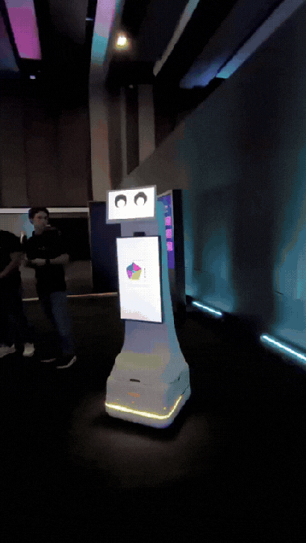
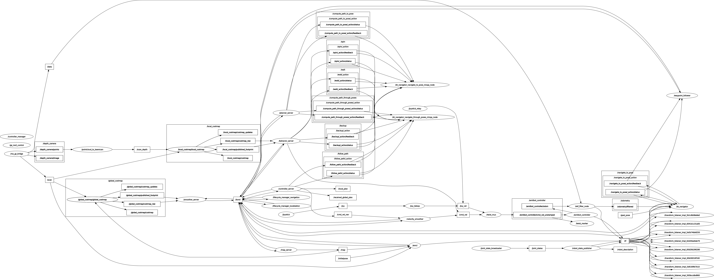

# amiibot

**Autonomous differential-drive robot for social navigation research**

[](https://docs.ros.org/en/humble/)
[](https://ubuntu.com/)
[](https://gazebosim.org/)
[](LICENSE)


---

## Overview

**amiibot** is a 4-wheel differential-drive robot (2 actuated + 2 castor) built for research in autonomous navigation and human-robot interaction. The platform supports a full simulation workflow in **Ignition Gazebo** and deployment on real hardware (**ODrive + RPLidar + RealSense D435**).

The long-term research goal is social navigation in dynamic human environments, targeting a publication on human-aware robot motion planning.

---

## Features

- **Dual mode**: identical ROS2 interface in simulation (Ignition Gazebo Fortress) and on real hardware
- **Full Nav2 stack**: AMCL localization, NavFn global planner, DWB local controller, recovery behaviors
- **Sensor fusion**: Extended Kalman Filter (odometry + IMU) via `robot_localization`
- **Dynamic obstacle avoidance**: RealSense D435 point cloud → `pointcloud_to_laserscan` → Nav2 local costmap
- **SLAM mapping**: SLAM Toolbox for autonomous map generation
- **Flexible teleoperation**: joystick and keyboard via `twist_mux` priority arbitration

---

## Hardware



| Component         | Model                   | Interface      | ROS2 Topic                              |
|-------------------|-------------------------|----------------|-----------------------------------------|
| Motor driver      | ODrive v3.6             | CAN bus (can1) | `/amiibot_controller/cmd_vel_unstamped` |
| IMU               | BNO055                  | I2C-7 (0x28)   | `/data`                                 |
| 2D LiDAR          | RPLidar A2M8            | USB            | `/scan`                                 |
| Depth camera      | Intel RealSense D435    | USB 3.0        | `/depth_camera/points`                  |
| Computer          | Ubuntu 22.04 / RTX 5070 | —              | —                                       |

**Physical parameters:**
- Wheel radius: `0.0855 m` · Wheel separation: `0.345 m`
- LiDAR mount: `xyz = [0.16, 0, 0.285]` relative to `base_link`
- D435 mount: `xyz = [0.12, 0, 0.60]` relative to `base_link`, FOV 87°, range 0.3–10 m

---

## Package Architecture

| Package                | Type          | Role                                                        |
|------------------------|---------------|-------------------------------------------------------------|
| `amiibot_description`  | ament_cmake   | URDF/xacro, Gazebo worlds, meshes, RViz config              |
| `amiibot_controller`   | ament_cmake   | `diff_drive_controller`, joystick teleop, `twist_mux`       |
| `amiibot_bringup`      | ament_cmake   | Launch entry points for simulation and real robot           |
| `amiibot_navigation`   | ament_python  | Nav2 stack, EKF, pre-built maps, navigation launch files    |
| `amiibot_behavior`     | ament_python  | HTTP → ROS2 bridge for audio sensor integration             |
| `ros-imu-bno055`       | ament_cmake   | BNO055 IMU driver                                           |

### Node Graph



---

## Installation

### Prerequisites

```bash
# ROS2 Humble — https://docs.ros.org/en/humble/Installation.html
sudo apt install -y \
  ros-humble-nav2-bringup \
  ros-humble-robot-localization \
  ros-humble-slam-toolbox \
  ros-humble-ros2-control \
  ros-humble-ros2-controllers \
  ros-humble-twist-mux \
  ros-humble-pointcloud-to-laserscan \
  ros-humble-joint-state-publisher-gui \
  ros-humble-xacro

# Ignition Gazebo Fortress
sudo apt install -y ros-humble-ros-ign-bridge ros-humble-ign-ros2-control
```

### Clone and build

```bash
mkdir -p ~/amiibot_ws/src
cd ~/amiibot_ws/src
git clone --recurse-submodules https://github.com/Gruzver/amiibot_ws.git .

cd ~/amiibot_ws
rosdep install --from-paths src --ignore-src -r -y
colcon build --symlink-install
source install/setup.bash
```

---

## Quick Start

> All commands assume `source install/setup.bash` has been run.

### 1 — Simulation (Ignition Gazebo)

```bash
ros2 launch amiibot_bringup amiibot_simulation.launch.py world_name:=small_house
```

Available worlds: `empty` · `small_house` · `small_warehouse` · `bookstore`

### 2 — Teleoperation

Keyboard control (in a new terminal):
```bash
ros2 run teleop_twist_keyboard teleop_twist_keyboard \
  --ros-args --remap cmd_vel:=/key_vel
```

### 3 — SLAM: Build a Map

```bash
ros2 launch amiibot_bringup amiibot_slam.launch.py use_sim_time:=true
```

Save the map when done:
```bash
ros2 run nav2_map_server map_saver_cli -f src/amiibot_navigation/maps/my_map
```

### 4 — Autonomous Navigation

```bash
ros2 launch amiibot_navigation nav2_bringup.launch.py use_sim_time:=true
```

1. In RViz: click **2D Pose Estimate** and click the robot's initial position on the map
2. Click **Nav2 Goal** and click a destination — the robot plans and navigates autonomously

### 5 — Real Robot

```bash
ros2 launch amiibot_bringup amiibot_bringup.launch.py
```

> **Note:** Real robot is currently in maintenance. ODrive CAN interface must be configured on `can1` before launching.

---

## Research Context

This platform is developed as part of a master's thesis research project on **socially-aware robot navigation**. The goal is to enable robots to navigate safely and naturally in environments shared with humans — respecting personal space, reacting to pedestrian intent, and communicating when needed.

Target venue: IEEE / robotics conference. The platform serves as the testbed for comparing navigation algorithms under social constraints.

---

## License

This project is licensed under the [MIT License](LICENSE).

---

## Acknowledgments

- [Nav2](https://github.com/ros-planning/navigation2) — navigation stack
- [linorobot2](https://github.com/linorobot/linorobot2) — reference architecture for ROS2 differential-drive robots
- [SLAM Toolbox](https://github.com/SteveMacenski/slam_toolbox) — mapping
- [robot_localization](https://github.com/cra-ros-pkg/robot_localization) — EKF sensor fusion
